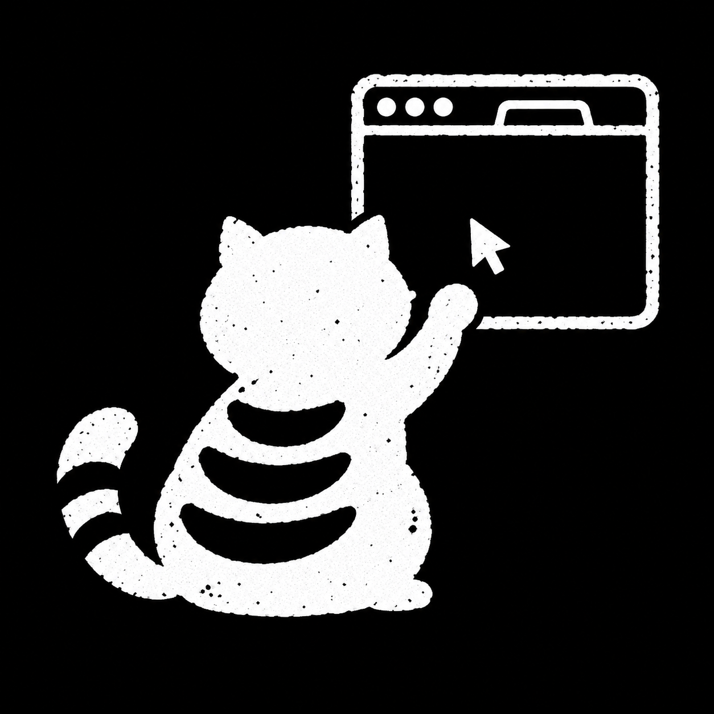

# da browser

<p align="center">
  
</p>

[pi](https://github.com/earendil-works/pi) extension for browser-control tools powered by [`agent-browser`](https://github.com/vercel-labs/agent-browser).

[Documentation](https://jeecabs.github.io/pi-tooling/da-browser/) · [All tools](https://jeecabs.github.io/pi-tooling/)

## Install

```bash
pi install https://github.com/Jeecabs/da-browser
```

Reload pi if already running:

```text
/reload
```

## Prerequisites

- `agent-browser` 0.38.1 or newer on `PATH`: `npm install -g agent-browser@latest`
- Arc or Chromium with remote debugging: `open -na "Arc" --args --remote-debugging-port=9222`
- `ffmpeg` on `PATH` only for `browser_record` (`brew install ffmpeg`)

The extension checks the minimum CLI version on session start and before every action. `/browser status` shows the installed version.

## Quick start

```bash
open -na "Arc" --args --remote-debugging-port=9222
```

Then in pi:

```text
/browser connect
/browser status
```

Open a page and snapshot it:

- `browser_open` navigates to a URL
- `browser_snapshot` collects fresh `@eN` refs
- `browser_find` locates by role/text/label and acts in one step

## Commands

| Command | Description |
| --- | --- |
| `/browser connect [port]` | Connect to Arc/Chromium through CDP |
| `/browser status` | Probe connection, page targets, browser version, artifacts |
| `/browser cleanup` | Disconnect/reset browser state for the session |

## Tools

27 typed tools cover open, snapshot, read, click, find, fill, navigation, tabs, eval, recording, traces, React inspection, a11y, and vitals. Full table and flags: [docs/tools.md](docs/tools.md).

## Development

```bash
pnpm install
pnpm check
pnpm test
```

`pnpm test:e2e` launches an isolated browser to verify strict shared-CDP pinning. `pnpm preview:control` previews the control indicator on light and dark backgrounds. See [docs/tools.md](docs/tools.md) for install alternatives and operational detail.

## Notes

- Browser refs (`@eN`) go stale after DOM mutations. Re-snapshot before clicking or filling.
- `browser_find` always acts. Use `browser_snapshot`/`browser_get` to inspect without mutation.
- Controlled tabs use a coral pointer favicon and a stationary edge glow. Releasing control restores the original favicon.
- Strict tab pinning keeps each pi session on its own tab. A closed pinned tab fails safely with `tab_gone`; recover with `browser_tab` new/switch or `browser_connect`.
- HAR captures can contain cookies, auth headers, and response bodies. Inspect before sharing.
- Artifacts live under `/tmp/da-browser/<cwd-slug>`.
