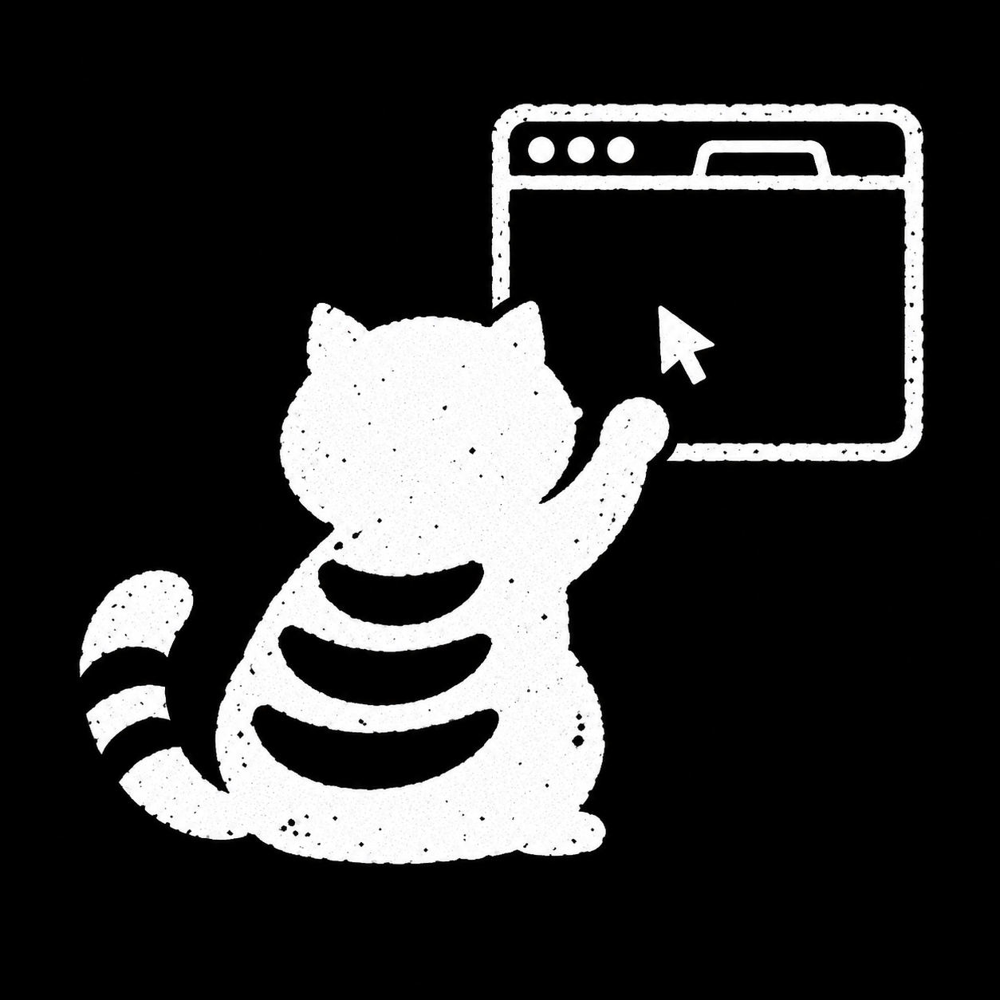

# da browser

<p align="center">
  
</p>

Browser control for [pi](https://github.com/earendil-works/pi) and [Claude Code](https://code.claude.com), powered by [`agent-browser`](https://github.com/vercel-labs/agent-browser). Both drive your own signed-in Arc or Chromium, each session on its own strictly pinned tab.

[Documentation](https://jeecabs.github.io/pi-tooling/da-browser/) · [All tools](https://jeecabs.github.io/pi-tooling/)

## Prerequisites

- `agent-browser` 0.38.1 or newer on `PATH`: `npm install -g agent-browser@latest`
- Arc or Chromium with remote debugging: `open -na "Arc" --args --remote-debugging-port=9222`
- `ffmpeg` on `PATH` only for `browser_record`, with the libvpx (WebM) and libx264 (MP4) encoders (`brew install ffmpeg` has both). `agent-browser doctor` checks them.

Each host checks the minimum CLI version on session start and before every action. `/browser status` shows the installed version.

## Install in pi

```bash
pi install https://github.com/Jeecabs/da-browser
```

Reload pi if already running:

```text
/reload
```

## Install in Claude Code

da-browser is a Claude Code [mod](https://code.claude.com/docs/en/plugins/mods/overview), which needs Claude Code 2.1.287 or newer.

```bash
claude plugin marketplace add Jeecabs/da-browser
claude plugin install da-browser@da-browser
```

Run `/reload-plugins` in a session that is already open. The tools appear as `mcp__da-browser__browser_*`, and the `slack` and `derive-client` skills as `da-browser:slack` and `da-browser:derive-client`.

Both hosts register the same 28 tools from one table, `src/browser-tools.ts`.

## Quick start

```bash
open -na "Arc" --args --remote-debugging-port=9222
```

Then, in either host:

```text
/browser connect
/browser status
```

Open a page and snapshot it:

- `browser_open` navigates to a URL
- `browser_snapshot` collects fresh `@eN` refs
- `browser_find` locates by role/text/label and acts in one step

## Commands

| Command | Description |
| --- | --- |
| `/browser connect [port]` | Connect to Arc/Chromium through CDP |
| `/browser status` | Probe connection, page targets, browser version, artifacts |
| `/browser cleanup` | Disconnect/reset browser state for the session |

In Claude Code, `/browser` runs at once, even while Claude is working, without starting a turn.

## Tools

28 typed tools cover open, snapshot, read, click, find, fill, navigation, tabs, eval, recording, traces, HAR and cookie export, React inspection, a11y, and vitals. Full table and flags: [docs/tools.md](docs/tools.md).

## How it shows up

Both hosts answer the same three questions, each in one place:

| Question | pi | Claude Code |
| --- | --- | --- |
| Where is the agent's browser? | Status chip | Status line |
| What is it doing right now? | Trail row above the editor | Band above the prompt |
| What did it do, and what changed? | Tool row: the call, then new facts | Tool row: the call, then new facts |

The raw output (snapshots, page text) goes to the model, never to the transcript. The trail disappears when the browser is idle.

## Skills

| Skill | Description |
| --- | --- |
| `derive-client` | Record a site once, then generate a zero-dependency client/CLI that calls its internal API directly. Masked HAR analysis, safe cookie export, `smoke` drift check. |
| `slack` | Slack web app on these tools: unreads, messages, threads, search, Activity, and a guarded send/reply that pins the destination and never touches drafts. |

## How it is built

One browser core, two hosts:

- **`src/agent-browser.ts` and its helpers** are the core. They import neither Node nor a host package. Everything they need from a host is the small `BrowserHost` in `src/host.ts`: run a command, write a file, cwd, home, and session id.
- **`src/index.ts` with `src/pi-host.ts`** is the pi extension. It uses `pi.exec` and `node:fs`.
- **`hooks/register.tsx`** is the Claude Code mod. It uses `$.process` and `$.fs`.
- **`src/browser-present.ts`** turns calls into words and facts for both hosts. `src/browser-ui.ts` paints them for pi; the mod paints them for Claude Code.

## Development

```bash
pnpm install
pnpm check
pnpm test
claude plugin validate .
```

To work on the mod with hot reload, load this folder in Claude Code with `claude --plugin-dir .`. `pnpm test:e2e` launches an isolated browser to verify strict shared-CDP pinning. `pnpm preview:control` previews the control indicator on light and dark backgrounds. See [docs/tools.md](docs/tools.md) for install alternatives and operational detail.

## Notes

- Browser refs (`@eN`) survive same-document updates for elements that stay; a replaced element or a navigation invalidates them. Re-snapshot after navigation, or when an action on a ref fails.
- `browser_find` always acts. Use `browser_snapshot`/`browser_get` to inspect without mutation.
- Controlled tabs get a stationary coral edge glow and a favicon that names the agent: a coral pointer under pi, a coral pointer with a sparkle under Claude Code. Claude's small PNG is embedded, so it needs no image download. Releasing control restores the original favicon.
- Strict tab pinning keeps each session on its own tab, pi and Claude Code alike (`pi-…` and `cc-…` daemon sessions). A closed pinned tab fails safely with `tab_gone`; recover with `browser_tab` new/switch or `browser_connect`.
- In Claude Code, raw `agent-browser --cdp` or `connect` through Bash is refused, because it would bypass the session's pinned tab.
- HAR captures can contain cookies, auth headers, and response bodies. Inspect before sharing.
- Artifacts live under `/tmp/da-browser/<cwd-slug>`.
