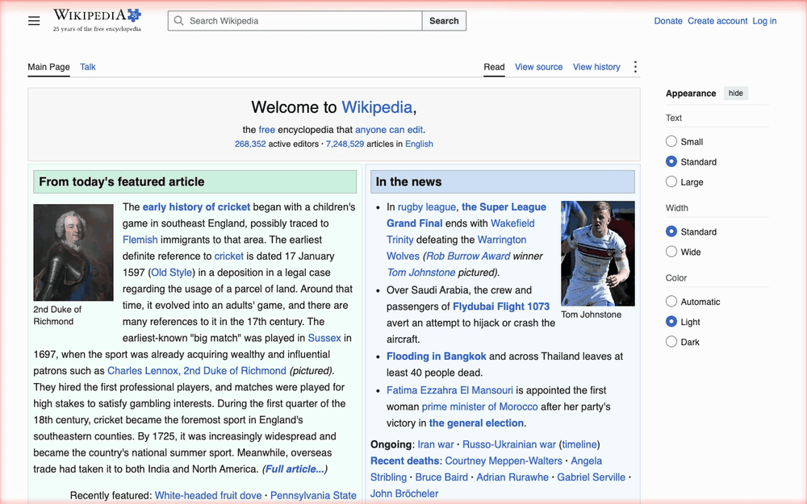
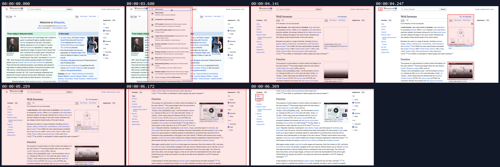

# da browser

Let [Claude Code](https://code.claude.com) and [pi](https://github.com/earendil-works/pi) drive your own signed-in Arc or Chromium. Each agent gets a tab of its own and leaves yours alone.

<p align="center">
  
</p>

## One browser, many agents

<p align="center">
  
</p>

<table>
  <tr>
    <td width="50%" valign="top"><b>Already signed in</b><br>It drives your real browser, so dashboards, inboxes and admin panels just work. No logging in again, no copied cookies.</td>
    <td width="50%" valign="top"><b>One tab each</b><br>Every session is pinned to its own tab, so agents don't wander into yours or each other's. If an agent's tab is closed, it stops safely instead of grabbing another.</td>
  </tr>
  <tr>
    <td width="50%" valign="top"><b>Easy to spot</b><br>The agent's tab gets a coral edge glow and its own favicon: a pointer for pi, a pointer with a sparkle for Claude Code.</td>
    <td width="50%" valign="top"><b>Moves like a person</b><br>Clicks and drags travel a curved, eased path, so hover menus open on the way and pointer-path bot checks see real movement.</td>
  </tr>
</table>

## Install

**Claude Code** (2.1.287 or newer)

```bash
claude plugin marketplace add Jeecabs/da-browser
claude plugin install da-browser@da-browser
```

**pi**

```bash
pi install https://github.com/Jeecabs/da-browser
```

**Both need** agent-browser 0.38.1 or newer, and Arc (or Chromium) started with remote debugging:

```bash
npm install -g agent-browser@latest
open -na "Arc" --args --remote-debugging-port=9222
```

Then run `/browser connect` in your agent, or just ask it to use the browser.

## Ask for things like

- "Open the Vercel dashboard and tell me why the last deploy failed."
- "Sign up on localhost:3000 with a test email and record a video of it."
- "What's unread in my Slack?"
- "Run an accessibility audit on our pricing page."
- "Why is this page slow? Check its web vitals."
- "Record this site's API calls and build me a client for them."

## Recordings you can skim

`browser_record` films the agent's tab with the cursor drawn in, and can save a contact sheet next to the video: one picture of the moments the page changed, with the changes boxed.

<p align="center">
  
</p>

## Tools

28 tools, the same in both hosts. Full reference in [docs/tools.md](docs/tools.md).

| To | Use |
| --- | --- |
| See the page | `browser_snapshot` `browser_read` `browser_get` `browser_is` `browser_checkpoint` |
| Act on it | `browser_click` `browser_find` `browser_fill` `browser_select` `browser_press` `browser_scroll` |
| Get around | `browser_open` `browser_nav` `browser_tab` `browser_wait` |
| Capture | `browser_record` `browser_har` `browser_trace` `browser_cookies` |
| Debug and audit | `browser_debug` `browser_eval` `browser_react` `browser_a11y` `browser_vitals` |
| Set up | `browser_connect` `browser_status` `browser_set` `browser_command` |

`/browser connect [port]`, `/browser status` and `/browser cleanup` run without starting a turn.

## Skills

- **`slack`** reads your Slack web app (unreads, mentions, threads, search) and sends only after checking the destination.
- **`derive-client`** records a site once, then writes a standalone client that calls its API directly, so repeat work skips the browser.

## Settings

| Variable | Default | Change it to |
| --- | --- | --- |
| `PI_BROWSER_PORT` | `9222` | Another remote debugging port |
| `DA_BROWSER_INPUT_MODE` | `human` | `instant` for 40ms clicks instead of about a second, or `smooth` for a straight 200ms glide |
| `PI_BROWSER_CONTROL_BANNER` | on | `0` to hide the coral glow and favicon, for clean screenshots and demo videos |

## Good to know

- It's your browser, signed in as you. Agents act only when you ask, but whatever they do, they do as you.
- HAR captures can hold cookies, auth headers and response bodies. Look before you share one.
- In Claude Code, running `agent-browser --cdp` straight from Bash is refused, because it would skip the tab pin.
- Screenshots, recordings and other captures land in your temp folder, under `da-browser/`.

## Development

```bash
pnpm install
pnpm check
pnpm test
claude plugin validate .
```

`pnpm test:e2e` launches a throwaway browser to check that sessions stay on their own tabs. How it's built, and the words it uses, are in [CONTEXT.md](CONTEXT.md).

<p align="center">
  
</p>
